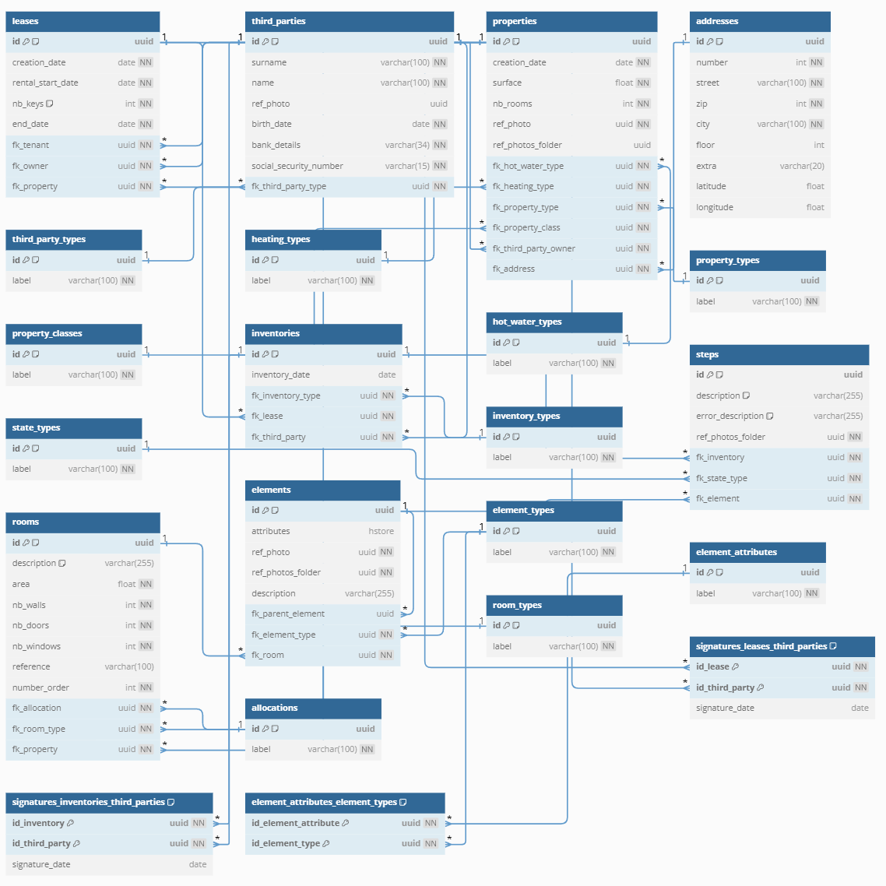

# Immobylette API Main

## Contexte du projet

Ce repository s'inscrit dans le cadre du projet Immobylette qui vise à réaliser une application mobile android de réalisation d'état des lieux. Cette application métier doit pouvoir être utilisée par une agence immobilière. L'API Main sera responsable de la gestion des états des lieux.

## Architecture

### Tech stack du projet :

- Java **22**
- Maven
- Spring Boot

Librairies utilisées :

- Lombok
- Mapstruct
- Flyway

L'architecture qui a été utilisée est celle des API REST accompagnée des standards d'API réalisée avec Spring Boot. Pour pouvoir venir stocker les photos, nous allons stocker les informations des photos au sein d'une base de données ayant le MLD suivant : 



## Fonctionnement

### Authentification

Pour ajouter de la sécurité, l'authentification est basée sur la présence du header `X-Api-Key` dont la valeur doit être la même que la variable **API_KEY** du fichier application.yml

### Endpoints

- GET /folders/{id}/photos

Récupération d'une photo d'un dossier

- GET /properties/{id}

Récupération des informations d'une propriété 

- GET /properties

Récupération des informations de l'ensemble des propriétés

- POST /properties/{id}/start

Démarage d'un état des lieux

- GET /inventories/{id}/room

Récupération des informations sur la prochaine piece dans laquelle se rendre

- GET /inventories/{id}/elements

Récupération des informations sur les elements de la piece actuelle 

- GET /inventories/{id}/walls

Récupération des informations sur les walls de la piece actuelle 

- GET /inventories/{id}/walls

Récupération des informations d'un élément

- GET /inventories/{id}/elements/{id}

Permet de créer un nouvel état d'un élement 

- POST /inventories/{id}/sign

Permet de signer un état des lieux

- POST /inventories/{id}/elements/{id}/same

Permet de récuperer l'état de l'élément de l'état des lieux précedent

- GET /inventories/{id}/elements/{id}/summary

Récuperer le résumé de l'état des lieux

- GET /third-parties/agents

Récuperer les informations des agents immobiliers

## Build de l'application

### Pré-requis

Certaines variables d'environnement sont necessaire et sont définit danss le fichier `Immobylette/immobylette--api-main/src/main/resources/application.yml` :

- **DB_HOST** : host de la base de données
- **DB_PORT** : port de la base de données
- **DB_NAME** : nom de la base de données
- **DB_SCHEMA** : nom du schéma de la base de données
- **DB_USER** : username à utiliser
- **DB_PASSWORD** : mot de passe de l'utilisatteur à utiliser
- **API_KEY** : clé d'api pour pouvoir utiliser l'API
- **PHOTO_API_URL** : clé d'api pour pouvoir utiliser l'API
- **PHOTO_API_KEY** : clé d'api pour pouvoir utiliser l'API

Note : pour le bon fonctionnement du projet, il est nécessaire que l'API_KEY fournit ici ainsi que dans l'API Photo soient les mêmes, sinon les deux API ne seront pas en mesure de communiquer entre elles.

Une fois toutes ces modifications faites, il est possible de build l'application

### Build

Pour générer le fichier .jar, il suffit simplement de lancer la commande suivante :

```bash
mvn clean install -DskipTests
```

### Build de l'image docker

Pour pouvoir build l'image docker, il faut exécuter la commande suivante : 

```bash
docker build -t latest .
```
